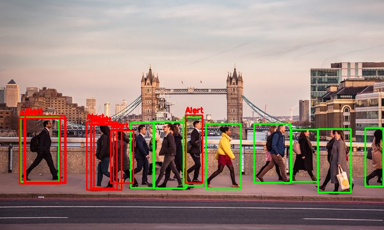

# Social Distancing Detection 🚀 💥 
```
An AI tool that helps the Customers and Workers to monitor Social distancing
in a crowded Workplace.
```
## Abstract 🤩 ☺️

```
In the fight against the coronavirus, social distancing has proven to be a very effective measure to slow down the 
spread of the disease. While millions of people are staying at home to help flatten the curve, many customers in 
the manufacturing and pharmaceutical industries are still having to go to work everyday to make sure our basic needs
are met. To help ensure social distancing protocol in their workplace, I have developed an AI-enabled social distancing 
detection tool that can detect if people are keeping a safe distance from each other by analyzing real time video 
streams from the camera.

```
## Screenshots 🆒 😎

#### *1. Detection on an image* 



#### *2. Detection on a video*


## Requirements 💻 🖥️

⚡ [Numpy](https://numpy.org/) - *To Work with multidimensional arrays.*
<br>
⭐ [OpenCV](https://opencv.org/) - *To Work with images and videos.*
<br>
🌠 [yolov4 weights](https://github.com/kiyoshiiriemon/yolov4_darknet/tree/master/cfg) - *To Download the yolov3.weights for COCO dataset.*
<br>

##  Procedure ✍️ 👇

> Run these in your terminal

1. Clone the repo using 

```
    git clone repo_url 
``` 
2. Go to the cloned directory 

``` 
    cd social-distance-detector
```
3. To make the model run with an image

```
    python SDD_Image.py
```
4. To make the model run with a video
        
``` 
    python SDD_Video.py
```
5. To make the model run with live streaming webcam

``` 
    python SDD_Camera.py
```
